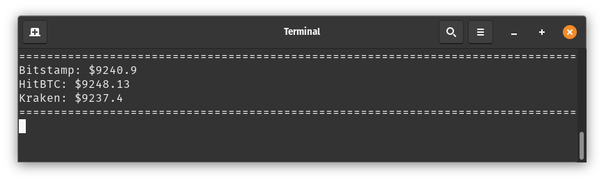

# Price Tracker

Console app written in rust that connects to exchanges and displays current XBT / USD price

It uses tokio and tungstenite libraries with each exchange running in separate thread.

